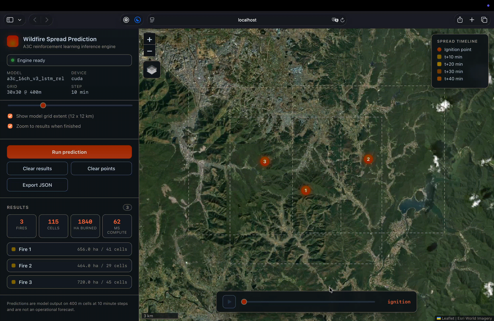

# WildFirePrediction/ai



#### AI Module for Real-Time Wildfire Spread Prediction

This repository contains the AI components for a real-time wildfire spread prediction system, powered by geospatial data pipelines, reinforcement learning, and satellite-based fire detection feeds.

## Features

> - High resolution (300m) wildfire spread forecasting  
> 
> - RL based propagation model (A3C) trained on 10 years of data  
> 
> - Real time monitoring mode integrated with KFS(산림청) fire reports  
> 
> - Demo mode with synthetic ignition events
> 
> - Systemd service deployment for background inference and 24/7 monitoring

## Quick Start

### 1) Clone the Repository

- Renaming repo to `WildfirePrediction` is optional, but recommended for clarity

```bash
git clone https://github.com/WildFirePrediction/ai.git WildFirePrediction
cd WildFirePrediction
```

### 2) Download Required Data (~1.6GB)

- script to download **embedding data** to construct **environment tiles** for inference
- **google drive (wget)**

```bash
./download_data.sh
```

# Running the Wildfire Prediction

> **Tested Environment**
> - Ubuntu 24.04.3 LTS  
> - CUDA 13.0  
> - NVIDIA Driver 580.95.05  

---

## 0. (Recommended) Install CUDA + NVIDIA Driver

- Optional, but recommended to match tested environment

```bash
./install_env.sh
```


## 1. Create Virtual Environment & Install Dependencies

```bash
python3 -m venv .venv
source .venv/bin/activate
pip install -r requirements.txt
```


## 2. Run Inference

## 2-1. Demo Mode (Fake Fire Data)

```bash
./start_demo.sh
```

- Generates synthetic ignition every 120 seconds and runs full inference.
- Creates html visualization and JSON output for each inference.


```
WildfirePrediction
 └── inference/ 
         └──demo_rl/
               └──outputs/
                     ├──*.html
                     └──*.json
```


## 2-2. Production Mode (Real KFS API Monitoring)

```bash
./start_monitoring.sh
```

- Polls KFS API for new fire detections  
- Runs wildfire spread inference  
- Sends results to production backend 

```bash
# Configure backend URL in .env
EXTERNAL_BACKEND_URL=https://api.example.com/wildfire/predictions
```


## 2-3. Interactive Web Demo

```bash
./start_web.sh     # start engine + web server
./stop_web.sh      # stop everything
```

- Browser UI on port `8080` (`--port` to change). The start script prints the Tailscale / LAN / local URLs.
- Click anywhere on the map of South Korea to place one or more ignition points, set the ignition time and prediction horizon (10 min steps, up to 2 hours), then run inference.
- Shows predicted spread per timestep on the 400m grid with a timeline player, plus live KMA weather, terrain and spread statistics per fire.
- Saves a JSON result for every prediction.

```
WildfirePrediction
 └── webdemo/
        ├──server.py       # Flask app + JSON API
        ├──engine.py       # RL inference wrapper
        ├──static/         # map UI
        └──outputs/*.json
```


# Background Deployment (systemd)

### 1. Install Services

```bash
sudo cp deployment/wildfire-api.service /etc/systemd/system/
sudo cp deployment/wildfire-monitor.service /etc/systemd/system/
sudo systemctl daemon-reload
```

### 2. Start Services

```bash
sudo systemctl start wildfire-api
sudo systemctl start wildfire-monitor
```

### 3. Stop Services

```bash
sudo systemctl stop wildfire-api
sudo systemctl stop wildfire-monitor
```


## Development Notes

- This repository contains only the AI inference engine.  
- Due to file size limits, training data is maintained [elsewhere](https://huggingface.co/datasets/chaseungjoon/wildfire-korea-episodes-300m).

